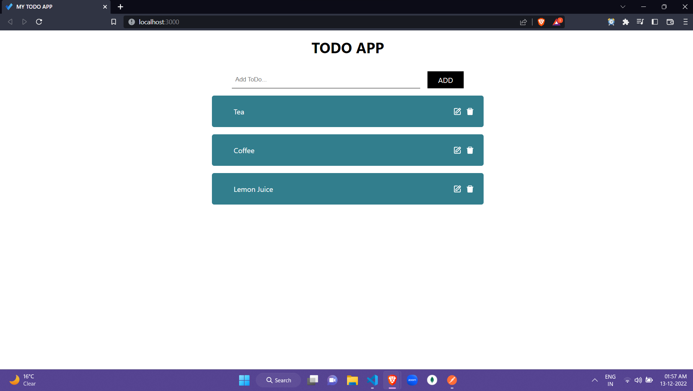
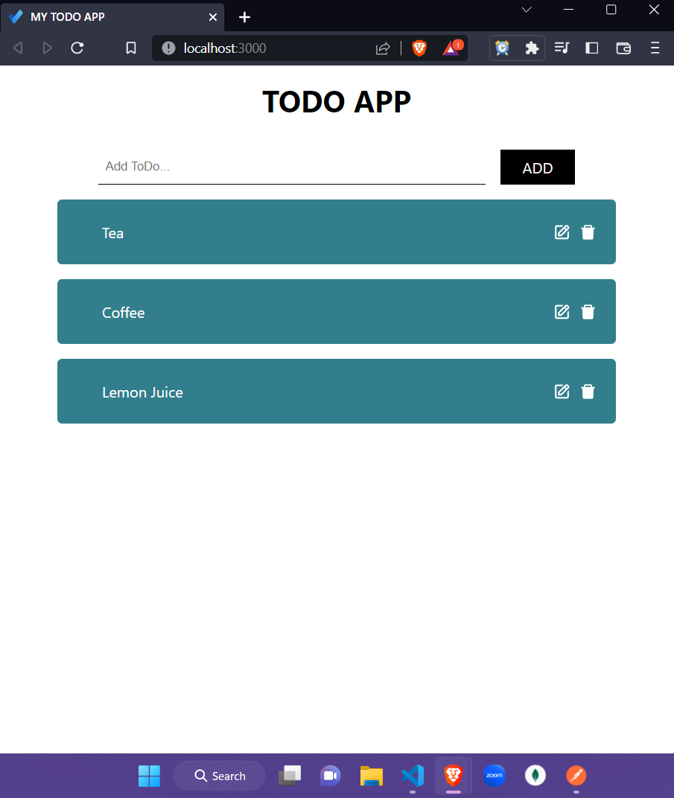
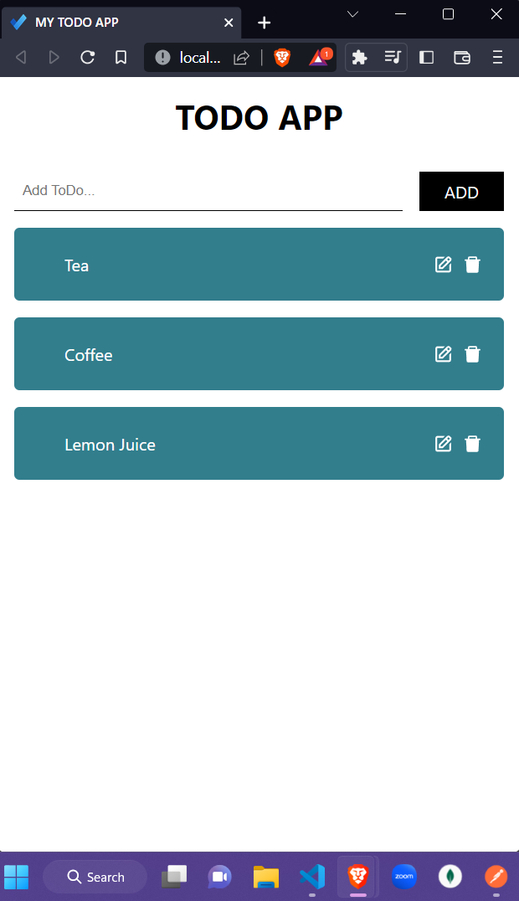

# TODO APP FRONTEND

## About

- This is a Todo App that I built in react.
- In this Todo App you can able to add a new todo, update the todo and also you can delete the todo.

## Deployed link 👇👇👇

[MY TODO APP](https://abhijit-fullstack-todo-app.netlify.app/)

## Features

- Add a new todo
- Update a existing todo
- Delete the todo from the list

## Files and Folder structure

- ### assets

  - ### [desktop.png](./assets/desktop.png)
  - ### [mobile.png](./assets/mobile.png)
  - ### [tablet.png](./assets/tablet.png)

- ### public

  - ### [index.html](./public/index.html)
  - ### [logo.png](./public/logo.png)

- ### src

  - ### components

    - ### [Todo.jsx](./src/components/Todo.jsx)

  - ### utils

    - ### [HandleApi.js](./src/utils/HandleApi.js)

  - ### [App.js](./src/App.js)

  - ### [index.css](./src/index.css)

  - ### [index.js](./src/index.js)

- ### .gitignore

- ### [package-lock.json](./package-lock.json)

- ### [package.json](./package.json)

## Usage guide

- git clone https://github.com/abhijitnr/Todo-App-Frontend.git
- cd frontend
- npm install
- npm start

## Overview

## Desktop Screen

- 

## Tablet Screen

- 

## Mobile Screen

- 
